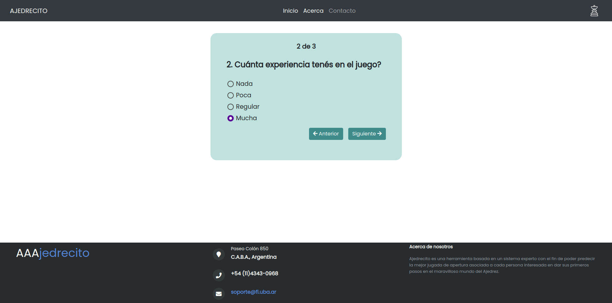

# T.P. Fallas 1

## Pasos para correr el código:

1- Instalar flask (Recomendación https://phoenixnap.com/kb/install-flask )

2- Exportar la variable de entorno (``` export FLASK_APP=fallas.py```)

3- Correr la app con ```flask run```.

4- Acceder al servidor local en el puerto especificado según diga en la consola (EJEMPLO: http://127.0.0.1:5000/ ).


